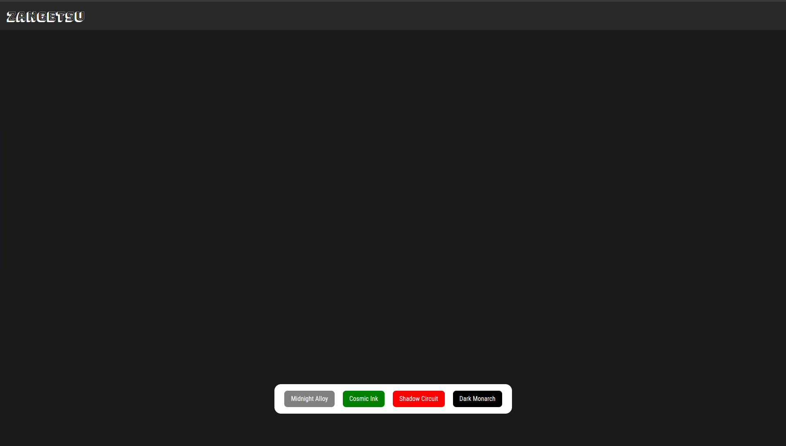

# React Theme Changer

A lightweight React application demonstrating a dynamic theming system using CSS Variables and the Context API.

> **Note:** This project was built as a learning exercise to master React hooks and modern CSS architecture.

## 🚀 Overview

This application provides a simple interface to toggle between Light and Dark modes. Instead of using a CSS-in-JS library, it leverages native CSS variables for high performance and clean separation of concerns.

## ✨ Features

-   **Multiple Theme Support:** Seamless switching between Multiple themes.
-   **Smooth Transitions:** CSS transitions ensure colors fade gently rather than flashing abruptly.
-   **Persistent State:** Uses React Context to manage the theme state globally.
-   **Custom Typography:** Integrates custom fonts (`Roboto Condensed` and `Bungee`).

## 🛠️ Tech Stack

-   **Frontend:** React.js (Vite)
-   **Styling:** Tailwind CSS (for layout) + Native CSS Variables (for theming)
-   **State Management:** React Context API

## ⚙️ How It Works

The theming engine relies on the relationship between React's state and CSS Custom Properties (Variables).

### 3. The Logic (`ThemeContext.jsx`)

The React Context handles the switching logic. When the toggle is pressed:

1. The context updates the state.
2. It creates a side effect that modifies the `document.documentElement` (the `<html>` tag).
3. It adds/removes the `.theme-light` or `.theme-dark` class, instantly cascading the new CSS variable values down the DOM tree.

## 📦 Getting Started

To run this project locally:

1. **Clone the repository**
```bash
git clone [https://github.com/abhi-afk-dev/Theme_Changer.git](https://github.com/abhi-afk-dev/Theme_Changer.git)

```


2. **Navigate to the frontend directory**
```bash
cd theme-changer-app/frontend

```


3. **Install dependencies**
```bash
npm install

```


4. **Run the development server**
```bash
npm run dev

```


## 📸 Screenshots



## 📄 License

This project is open source and available under the [MIT License](https://www.google.com/search?q=LICENSE).

